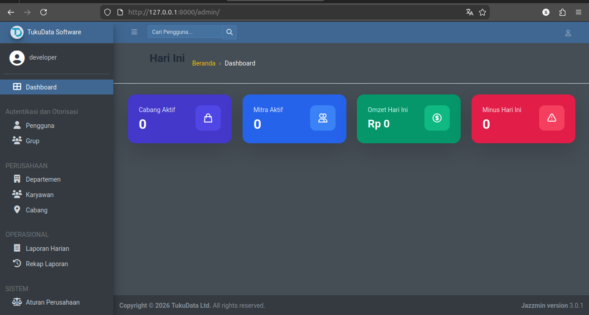
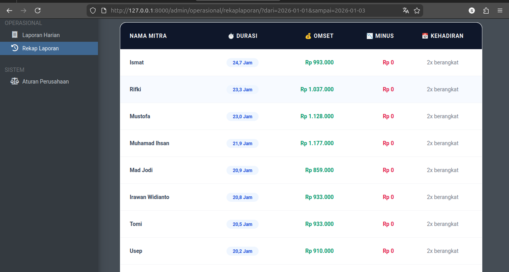

# 🥞 MMDS (Martabak Mini Dayung Sari) - Management System

[](https://opensource.org/licenses/MIT)
[](https://www.djangoproject.com/)
[](https://tailwindcss.com/)
[](https://supabase.com/)
[](https://railway.app/)

**MMDS** adalah sistem manajemen operasional terpadu yang dirancang khusus untuk bisnis kuliner (Martabak Mini). Aplikasi ini menangani seluruh alur bisnis mulai dari manajemen karyawan, pengelolaan cabang, hingga otomasi laporan harian dan perhitungan profit/loss.

---

## 📸 Tampilan Aplikasi

### Dashboard Utama


### Evaluasi Performa Mitra


---

## ✨ Fitur Utama

### 🏗️ Arsitektur Modular
Aplikasi dibagi menjadi beberapa modul utama untuk skalabilitas:
- **Perusahaan**: Manajemen Departemen, Karyawan (dengan ID otomatis `DSXXXX`), dan Cabang.
- **Operasional**: Input Laporan Harian (LH), detail kehadiran mitra, dan pengeluaran operasional.
- **Sistem**: Pengaturan pusat untuk rumus konstanta adonan, harga target per gram, dan skema bonus/gaji.

### 🧠 Otomasi & Logika Bisnis
- **Smart Calculation**: Menghitung otomatis Target Omzet, Omzet Bruto, Sisa Adonan, dan Selisih (Plus/Minus) secara real-time saat data disimpan.
- **Validasi Ketat**: Proteksi *double-entry* mitra untuk mencegah input ganda di cabang atau tanggal yang sama.
- **Image Pipeline**: Automasi kompresi foto nota dan bukti transfer menggunakan Pillow sebelum diunggah ke cloud storage.

### 📊 Dashboard Modern
- Dashboard admin kustom menggunakan **Tailwind CSS** yang menampilkan metrik kunci (Total Omzet, Cabang Aktif, Mitra Aktif, dan Total Minus) secara visual.
- Integrasi UI menggunakan **Jazzmin** untuk pengalaman administrasi yang profesional.

### 📈 Evaluasi & Rekapitulasi Mitra
- **Dynamic Reporting**: Fitur evaluasi performa mitra berdasarkan rentang tanggal yang fleksibel.
- **Analytics Table**: Menampilkan agregasi total durasi kerja (dalam jam), akumulasi omzet, hingga total minus per mitra secara otomatis.
- **Branch Performance**: Monitoring jumlah keberangkatan harian per cabang untuk memantau produktivitas outlet.

---

## 🛠️ Tech Stack
- **Backend:** Python 3.x, Django 6.0
- **Frontend:** Tailwind CSS, Jazzmin Admin
- **Database:** PostgreSQL
- **File Storage:** Supabase S3 (Boto3)
- **Deployment:** Railway / WhiteNoise (Static Files)

---

## 🚀 Instalasi Lokal

1. **Clone Repository:**
   ```bash
   git clone [https://github.com/username/mmds-martabak.git](https://github.com/username/mmds-martabak.git)
   cd mmds-martabak
2. **Setup Virtual Environment:**
   ```bash
   python -m venv venv
   source venv/bin/activate  # Windows: venv\Scripts\activate
3. **Install Dependencies:**
   ```bash
   pip install -r requirements.txt
4. **Environment Variables: Buat file `.env` dan lengkapi data berikut:**
   ```bash
   SECRET_KEY=your_secret_key
   DEBUG=True
   DATABASE_URL=your_postgres_url
   SUPABASE_ACCESS_KEY_ID=your_key
   SUPABASE_SECRET_ACCESS_KEY=your_secret
   SUPABASE_S3_ENDPOINT=your_endpoint
5. **Run Migrations & Server:**
   ```bash
   python manage.py migrate
   python manage.py runserver

---

## 📄 Lisensi

Proyek ini dilisensikan di bawah MIT License - bebas digunakan untuk pembelajaran atau pengembangan lebih lanjut dengan tetap mencantumkan atribusi penulis asli.
